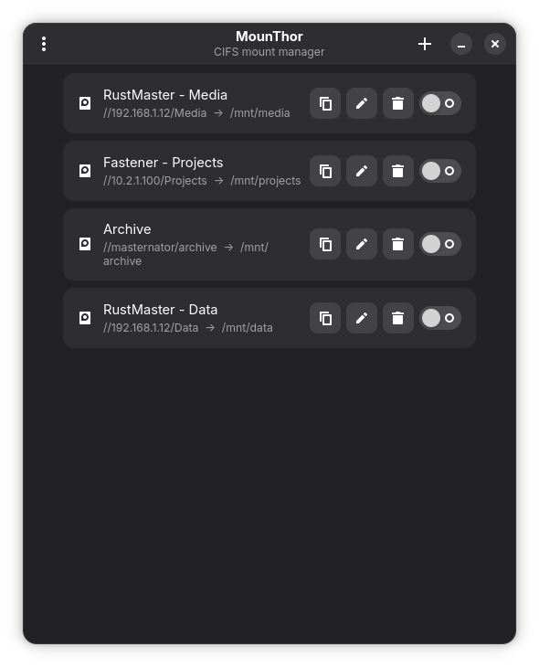
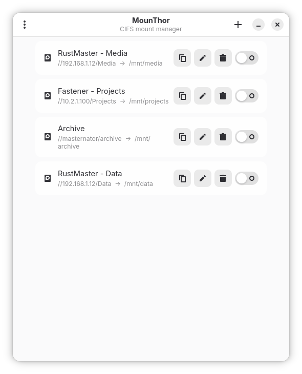

# MounThor
#### CIFS/SMB mount manager for Linux.

<table>
  <tr>
    <td align="center">
      <strong>Dark theme</strong><br>
      
    </td>
    <td align="center">
      <strong>Light theme</strong><br>
      
    </td>
  </tr>
</table>

**A simple Linux desktop application for fast and convenient SMB network share mounting.**

Save frequently used shares along with their mount settings and connect them with just a few clicks. For credentials, you can either save them in the application's configuration file or enter the password each time a share is mounted. You can also use your current Linux account name as the SMB username without storing it in the configuration.
The app provides batch actions for connecting and disconnecting all shares or selected shares, allowing you to authenticate with your superuser password once and apply the action to multiple shares. Individual shares can also be configured to automatically mount when the application starts.
The interface follows the system's GTK light and dark themes and respects the configured accent color.

**The goal is to provide a simple and elegant GUI built with GTK4 and libadwaita for managing CIFS/SMB mounts without repeatedly entering long mount commands and credentials or writing custom scripts for shares that do not need to be persistent.**

## Features
- Save frequently used SMB shares and their mount settings.
- Mount and unmount shares individually with a toggle.
- Select multiple shares and connect or disconnect them as a batch.
- Connect All and Disconnect All actions.
- Clear Selection for quickly deselecting multiple shares.
- Batch password handling with a single superuser authentication.
- Optionally remember SMB passwords in the application configuration.
- Use the current Linux account name as the SMB username without storing it.
- Configure custom CIFS mount options such as vers=3.1.1.
- Configure shares to automount when MounThor starts.
- Edit, duplicate, and remove saved shares.
- Automatically clean up temporary CIFS credential files left after an unexpected application exit.
- GTK4/libadwaita interface supporting system light and dark themes and the configured accent color.
- Responsive status feedback with spinners, icons, toasts, and logging.

### Security
MounThor uses the Freedesktop Secret Service API for secure credential storage when available. If Secret Service is not available, MounThor can still be used without saving passwords, or the user can explicitly choose to save a password unencrypted.

Versions prior to 0.8.0 store saved passwords in the JSON configuration file. When upgrading to 0.8.0 or later, MounThor will offer to migrate passwords stored in the configuration file to Secret Service when the corresponding share is mounted.

## Requirements

- Linux
- Python 3
- GTK4
- libadwaita
- cifs-utils
- polkit (pkexec)

## Development

MounThor is currently developed and tested with:

- Python 3.14
- GTK 4.23
- libadwaita 1.10 (beta)
- GLib 2.89
- cifs-utils 7.4
- polkit 124

## Installation

Download the latest MounThor release archive and extract it.

### Install

Open a terminal in the extracted MounThor directory and run:

```bash
./scripts/install-mounthor.sh
```

The installer installs MounThor for the current user:

* `~/.local/bin/mounthor` — application launcher
* `~/.local/share/mounthor/` — application files
* `~/.local/share/applications/io.github.mizgo.MounThor.desktop` — application menu entry

No administrator privileges are required.

After installation, MounThor should appear in your desktop environment's application menu. If it does not appear immediately, reopen the application launcher or allow a few moments for the desktop menu to refresh.

### Upgrade

To upgrade an existing installation, download and extract the newer release and run the same installer:

```bash
./scripts/install-mounthor.sh
```

The installer automatically replaces the installed application files.

Your saved shares, configuration, and application logs are preserved during upgrades.

### Uninstall

From the extracted MounThor directory, run:

```bash
./scripts/uninstall-mounthor.sh
```

The uninstaller removes the MounThor application files and desktop entry.

Your saved shares, credentials, configuration, and logs are kept by default. The uninstaller will ask whether you also want to remove them.

No administrator privileges are required.

## License
MounThor is licensed under the GNU GPL v3.0.